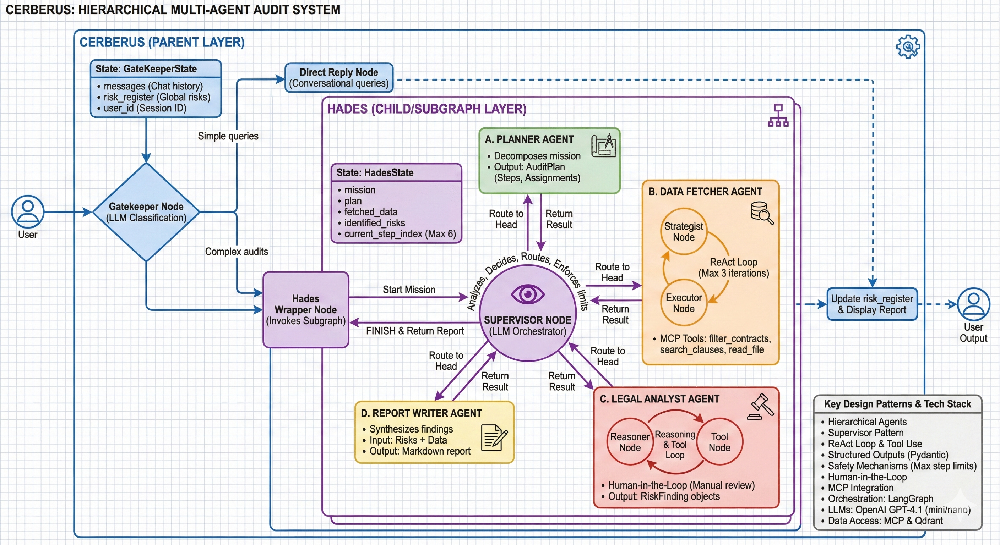
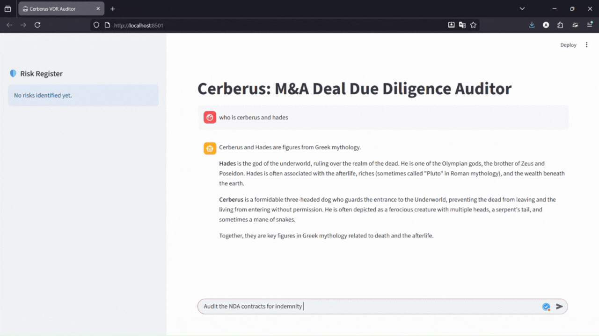

# Cerberus: Autonomous M&A Due Diligence Agent 🤖

[](https://www.python.org/downloads/)
[](https://github.com/langchain-ai/langgraph)
[](https://modelcontextprotocol.io/)
[](LICENSE)

> **An intelligent multi-agent system that autonomously audits M&A Virtual Data Rooms (VDRs) to identify legal and financial risks in contracts—transforming a 48-hour manual fire drill into a 3-minute automated scan.**

---

## 📖 Table of Contents

- [The Problem](#-the-problem-the-48-hour-fire-drill)
- [Why Agents? (Not Simple RAG)](#-why-agents-not-simple-rag)
- [System Architecture](#️-system-architecture)
- [Key Features](#-key-features)
- [Installation & Setup](#-installation--setup)
- [Data Pipeline](#-data-pipeline)
- [Usage](#-usage)
- [Evaluation Results](#-evaluation-results)
- [Project Structure](#-project-structure)
- [Demo](#-demo)
- [Contributing](#-contributing)

---

## 🔥 The Problem: The 48-Hour Fire Drill

In Mergers & Acquisitions, due diligence is a race against time:

- **Volume vs. Velocity**: M&A transactions involve 500+ contracts. Human teams have only 48-72 hours to review them before making a "Go/No-Go" decision.
- **Fatigue Factor**: Highly paid professionals spend hours searching for clauses (Ctrl+F), leading to missed "poison pill" risks like:
  - **Change of Control**: Contract termination upon acquisition → Immediate revenue loss
  - **Unlimited Liability**: Uncapped damages → Potential bankruptcy
  - **Exclusivity**: Market restrictions → Growth limitations
- **Data Silos**: Answers require cross-referencing PDFs with SQL databases (e.g., "Is this vendor active in our payment ledger?")

**The Market Gap**: Existing LegalTech tools are black boxes or simple keyword search engines—lacking **agentic reasoning** to navigate, query, verify, and synthesize findings across modalities.

---

## 🤖 Why Agents? (Not Simple RAG)

A standard "Chat with your PDF" (RAG) system is insufficient for professional audit workflows:

| Challenge | Standard RAG Approach | Cerberus Agentic Approach |
|:----------|:---------------------|:--------------------------|
| **Complex Filtering** | *Fails.* Semantic search for "NDAs from 2021" retrieves irrelevant documents (e.g., 2020 docs mentioning 2021) | **SQL Tool Use**: Generates precise queries (`WHERE type='NDA' AND year=2021`) before reading |
| **Missing Information** | *Hallucinates.* Tries to "guess" or retrieves irrelevant chunks to satisfy the prompt | **Reasoning Loops**: Agent thinks: *"No Liability clause found. Try broader search. Still nothing? Flag as 'MISSING'."* |
| **Multi-Step Logic** | *Struggles.* Cannot handle "Find contracts with unlimited liability AND paid >$10k" | **Orchestration**: SQL Agent checks payment ledger → Legal Agent checks clauses → Aggregator combines results |
| **System Agnostic** | *Rigid.* Hardcoded to specific local folder | **MCP Protocol**: Uses standardized tools (`list_files`, `read_file`) for portability to any VDR |

**Key Insight**: Agents don't just *fetch* text—they **execute workflows** like a junior analyst following a checklist.

---

## 🏗️ System Architecture

Cerberus is a **two-tier hierarchical multi-agent system** built with [LangGraph](https://github.com/langchain-ai/langgraph):

**Architecture Diagram**: 


### Component Overview

#### 1. **Cerberus (Parent Layer)**
- **Gatekeeper Node**: LLM-powered router classifying user intent
  - Simple queries → Direct chat response
  - Complex audits → Hades invocation
- **State**: Chat history + Global risk register

#### 2. **Hades (Subgraph Layer)**
- **Supervisor Node**: LLM-based orchestrator managing plan execution
  - Enforces max 6-step limit to prevent runaway
  - Generates self-contained instructions for each specialist
  - Routes to appropriate "head" agents

#### 3. **The Four "Heads" (Specialist Sub-Agents)**

##### A. **Planner Agent**
- Decomposes mission into structured execution plan
- Output: `AuditPlan` with step-by-step instructions + dependencies

##### B. **Data Fetcher Agent** 
- ReAct-style loop: Strategist → Executor → Observation
- **Tools**: `filter_contracts` (SQL), `search_clauses` (Vector), `read_file` (MCP)
- Max 3 iterations to prevent over-fetching

##### C. **Legal Analyst Agent**
- Reasoning + Tool Use loop for risk identification
- Analyzes fetched data, formulates hypotheses, requests additional data if needed
- Output: `RiskFinding` objects with severity, evidence, citations

##### D. **Report Writer Agent**
- Synthesizes findings into executive markdown report
- Includes citations with page numbers and evidence quotes


---

## ✨ Key Features

- ✅ **Hybrid Knowledge Base**: SQL metadata (dates, parties, types) + Qdrant vector embeddings (semantic search)
- ✅ **Model Context Protocol (MCP)**: Universal VDR connectivity (local, Google Drive, SharePoint)
- ✅ **Human-in-the-Loop (HITL)**: Agent can pause and request approval for high-risk actions
- ✅ **Structured Outputs**: Pydantic models ensure type-safe LLM responses
- ✅ **Safety Mechanisms**: 
  - Max step limits (6 for Hades, 3 for Data Fetcher)
  - Forced stop summaries when limits exceeded
- ✅ **Multi-Modal Reasoning**: Cross-references PDF clauses with SQL records
- ✅ **Real-Time Logging**: Streaming agent thoughts and actions to UI
- ✅ **Evaluation Framework**: LLM-as-a-Judge metrics with precision/recall tracking

---

## 🚀 Installation & Setup

### Prerequisites
- Python 3.10+
- Docker & Docker Compose
- OpenAI API Key

### 1. Clone Repository
```bash
git clone https://github.com/yourusername/cerberus-mna-agent.git
cd cerberus-mna-agent
```

### 2. Install Dependencies
```bash
# Install requirements
pip install -r requirements.in
```

### 3. Environment Configuration
Create a `.env` file in the project root:

```env
# OpenAI API
OPENAI_API_KEY=sk-...

# MySQL Configuration
MYSQL_ROOT_PASSWORD=yourpassword
MYSQL_DATABASE=mna_db
MYSQL_USER=mna_user
MYSQL_PASSWORD=yourpassword

# Qdrant Configuration
QDRANT_API_KEY=your_qdrant_key  # Optional for local deployment
```

### 4. Start Infrastructure
```bash
# Start Qdrant (Vector DB) and MySQL
docker-compose up -d

# Verify services are running
docker ps
```

### 5. Download CUAD Dataset
Download the [CUAD v1 dataset](https://www.atticusprojectai.org/cuad) and extract to:
```
data/CUAD_v1/
  ├── full_contract_txt/   # Text files
  ├── full_contract_pdf/   # PDF files (optional)
  ├── master_clauses.csv   # Ground truth labels
  └── CUAD_v1.json         # Dataset metadata
```

---

## 📊 Data Pipeline

The system uses a **two-phase ingestion pipeline**:

### Phase 1: Vector Indexing
Parses contracts PDFs, Chunks contracts and creates embeddings:

```bash
python ./scripts/indexing.py
```

**Process**:
1. **Parsing**: Docling PDF Parser
2. **Chunking**: Hierarchial Chunking
3. **Embedding**: BAAI/bge-base-en-v1.5 model
4. **Storage**: Qdrant collection `contracts_v1`

**Configuration**: [modules/src/mna_due_diligence/index/config.py](modules/src/mna_due_diligence/index/config.py)


### Phase 2: Metadata Extraction
Extracts structured metadata from contracts using LLMs:

```bash
python ./scripts/extract_metadata.py
```

**Output**: SQL table with columns:
- `filename`, `title`, `contract_type`, `party_a`, `party_b`, `effective_date`, `expiration_date`, `governing_law`

**Configuration**: [modules/src/mna_due_diligence/contract_metadata/config.py](modules/src/mna_due_diligence/contract_metadata/config.py)


**Logs**: All pipeline runs logged to `logs/indexing.log` and `logs/metadata_extraction.log`

---

## 🎯 Usage

### Option 1: Streamlit Chat Interface (Recommended)
```bash
streamlit run app.py
```

Navigate to `http://localhost:8501` and start chatting:

**Example Queries**:
- *"Find all contracts with Change of Control clauses"*
- *"Audit unlimited liability in NDAs signed after 2020"*
- *"Check if any contracts with Microsoft have exclusivity terms"*

### Option 2: MCP Server + CLI
Start the MCP server for programmatic access:

```bash
python -m uvicorn mcp_server:app --host 0.0.0.0 --port 8000
```

**Available MCP Tools**:
- `filter_contracts(contract_type, party_name)` - SQL-based filtering
- `search_clauses(query, filename)` - Semantic clause search
- `read_file(filename)` - Full contract content retrieval

---

## 📈 Evaluation Results

Evaluated on **100 CUAD contracts** (January 19, 2026):

| Clause Type | Parties Evaluated | Precision | Recall | 
|:-----------|:-----------------|:---------|:-------|
| **Anti-Assignment** | 2 | 66% | **100%** | 
| **Change of Control** | 3 | 75% | **100%** | 
| **Unlimited Liability** | 3 | 71% | **100%** | 

### Aggregate Performance
- **Total Precision**: 70%
- **Total Recall**: **100%** (Zero false negatives!)
- **LLM-as-a-Judge Score**: 8.5 / 10

**Key Takeaway**: Cerberus achieved **perfect recall** across all evaluated clause types, ensuring no ground-truth risks were missed—ideal for high-stakes legal screening workflows.

**Full Report**: [evaluation_report/summary.md](evaluation_report/summary.md)

**Detailed Logs**: [evaluation_report/logs/](evaluation_report/logs/)

---

## 📁 Project Structure

```
mna_due_diligence/
├── app.py                          # Streamlit UI
├── mcp_server.py                   # Model Context Protocol server
├── docker-compose.yml              # Infrastructure setup (Qdrant, MySQL)
├── requirements.in                 # Python dependencies
│
├── modules/src/mna_due_diligence/  # Core package
│   ├── agents/
│   │   ├── cerberus/               # Parent orchestrator
│   │   │   ├── hades/              # Deep audit subgraph
│   │   │   └── heads/              # Specialist agents
│   │   │       ├── planner_agent/
│   │   │       ├── data_fetcher_agent/
│   │   │       ├── legal_analyst_agent/
│   │   │       └── report_writer/
│   │   ├── master.py               # Legacy coordinator
│   │   ├── analyst.py              # Risk identification
│   │   └── reporter.py             # Report generation
│   │
│   ├── index/                      # Vector indexing pipeline
│   │   ├── orchestrator.py
│   │   ├── processing.py           # Chunking & embedding
│   │   └── config.py
│   │
│   ├── contract_metadata/          # Metadata extraction pipeline
│   │   ├── orchestrator.py
│   │   ├── extractor.py            # LLM-based parsing
│   │   └── config.py
│   │
│   ├── evals/                      # Evaluation framework
│   │   └── party_wise.py
│   │
│   └── db/                         # Database models
│
├── scripts/
│   ├── indexing.py                 # Run vector indexing
│   ├── extract_metadata.py         # Run metadata extraction
│   └── evaluation.py               # Run evals
│
├── data/
│   └── CUAD_v1/                    # Dataset (not included)
│       ├── full_contract_txt/
│       ├── master_clauses.csv
│       └── CUAD_v1.json
│
├── evaluation_report/              # Evaluation results
│   ├── summary.md
│   └── logs/
│
├── docs/
│   ├── motivation.md               # Problem statement
│   └── proposal.md                 # Project objectives
│
├── qdrant_storage/                 # Persistent vector DB storage 
└── logs/                           # Pipeline execution logs
```

---

## 🎬 Demo

### Interactive Chat Session



---

## 🧪 Running Evaluations

Evaluate agent performance on CUAD ground truth:

```bash
cd scripts
python evaluation.py
```

**Customization**: Edit [scripts/evaluation.py](scripts/evaluation.py) to change:
- Clause types: `ChangeOfControl`, `AntiAssignment`, `UnlimitedLiability`, `NonCompete`, `Exclusivity`
- Number of parties to evaluate
- Output report path

**Output**: JSON logs in `data/eval_reports/` with:
- True positives, false positives, false negatives
- Per-contract predictions with reasoning

---

## 🤝 Contributing

Contributions welcome! Please:

1. Fork the repository
2. Create a feature branch (`git checkout -b feature/AmazingFeature`)
3. Commit changes (`git commit -m 'Add AmazingFeature'`)
4. Push to branch (`git push origin feature/AmazingFeature`)
5. Open a Pull Request

**Development Setup**:
```bash
# Install dev dependencies
pip install -e "modules/[dev]"
```


---

## 🙏 Acknowledgments

- **Dataset**: [CUAD (Contract Understanding Atticus Dataset)](https://www.atticusprojectai.org/cuad)
- **Documents Processing**: [Docling](https://github.com/docling-project/docling)
- **Framework**: [LangGraph](https://github.com/langchain-ai/langgraph) for multi-agent orchestration
- **Protocol**: [Model Context Protocol (MCP)](https://modelcontextprotocol.io/) for universal data access
- **Embedding Model**: [BAAI BGE](https://github.com/FlagOpen/FlagEmbedding) for semantic search

---

## 📧 Contact

For questions or support:
- Email: a.anurag1024@gmail.com

---

<p align="center">
  <strong>Built for M&A professionals who deserve better tools</strong>
</p>
